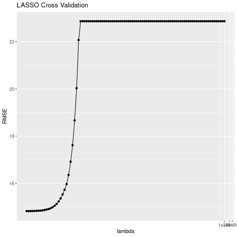

```{r setup, include=FALSE}
knitr::opts_chunk$set(echo = TRUE)
packages <- c("lubridate", "tidyverse", "tidymodels", "rpart.plot", "vip", "Metrics", "knitr")

for (pkg in packages) {
  if (!require(pkg, character.only = TRUE)) {
    install.packages(pkg, dependencies = TRUE)
    library(pkg, character.only = TRUE)
  }
}
remove(packages, pkg)

```

## Abstract
have a summary of the paper

## Background
here's our data and why we chose it
here's where the data is from
here are our research questions

### Research Questions
- What predictors have the strongest effect on sentencing length?
- How accurately can we predict sentencing length?
- What predictors have the strongest effect on offence category?
- How accurately can we predict offence categories?

## Methods
### KNN

- basic explanation of model
In order to answer our second two research questions regarding prediction of
offense category, as well as determining which predictors have the strongest
effect on offense category, we decided to fit a KNN model. KNN stands for
k-nearest neighbor, which is an algorithm that cycles through each point
in a dataset, and identifies the k points that are closest to that point.
This k value is adjustable and helps determine the classifier itself, so tuning
k is critical for optimizing classification performance.
I grouped offenses/charges into 18 categories: controlled subst poss w/out 
prescription, burglary, murder, armed robbery, theft (identity or property),
battery, sexual assault, forgery, kidnapping,
illegal firearm/weapon/handgun use or possession, harassment, bribery,
drug/meth manufacturing, vehicular hijacking/theft, DUI, child porn,
obstructing justice, home invasion, and other.
- results
Because our dataset is so large (even with a 70-30 training-test split), I
expect the cross-validation to take a very long time to run, and I have
temporarily commented out that code.  I may need to make modifications to the
training-test split, as well as the number of possible k-values, to increase
efficiency. Once complete, I will create a confusion matrix to assess the model
(with the optimal k) on the test set.
```{r, warning = FALSE}
set.seed(445)
illinois_doc_data <- read.csv("../CSV Files/merged_data.csv")
cleaned_doc_data <- illinois_doc_data |> select(-c(last_name, name, id)) |>
  mutate(offense_category = as.factor(offense_category),
         adm_appx_age = appx_age,
         weight_lbs = as.numeric(weight),
         sex = as.factor(sex),
         height_in = as.numeric(height),
         race = as.factor(race),
         eye_color = as.factor(eyes),
         hair = as.factor(hair),
         class = as.factor(class),
         parent_institution = as.factor(parent_institution)) |>
  select(-c(eyes, height, weight, appx_age)) |> na.omit()
df_split <- initial_split(cleaned_doc_data, prop = 0.7)
df_train <- training(df_split)
df_test <- testing(df_split)
# FULL EXPECTED RUNTIME: 6+ hours?
#start_time <- Sys.time()
k_vals <- expand.grid(neighbors = c(10, 50, 100, 200, 500, 1000,
                                     2000, 5000, 10000))
knn_10foldcv <- vfold_cv(df_train, v = 10)
knn_spec <- nearest_neighbor(mode = "classification", neighbors = tune()) |>
  set_engine("kknn")
knn_rec <- recipe(offense_category ~ ., data = df_train) |>
  step_dummy(all_nominal_predictors()) |>
  step_normalize(all_numeric_predictors())
knn_wf <- workflow() |> add_recipe(knn_rec) |> add_model(knn_spec)
#tune_results <- tune_grid(knn_wf,
#                          resamples = knn_10foldcv,
#                          grid = k_vals)
#collect_metrics(tune_results)
#best_knn <- select_best(tune_results, metric = "accuracy")
#final_knn <- finalize_workflow(knn_wf, best_knn)
#final_knn_fit <- fit(final_knn, data = df_train)
#end_time <- Sys.time()
#elapsed <- end_time - start_time
#elapsed
# 2. Create a confusion matrix for the `test` data
#knn_preds <- predict(knn_fit, new_data = df_test)

#knn_test_res |>
#  conf_mat(truth = offense_category, estimate = .pred_class)

# test error
#test_res |>
 # accuracy(truth = offense_category, estimate = .pred_class) |>
#  mutate(error = 1 - .estimate) |>
#  pull(error)


```


### Random Forest

(Want to use this in intro) We have taken 3 datasets from kaggle sentencing, person, and marks. Across these datasets we have a unique id for each prisoner assigned by the Illinois Department of Corrections. (Talk about data cleaning and the work put into making one final dataframe)


With such a large dataset at 59388, we decided random foresting would be a good model to run our data through for predicting a prisoners sentencing time in years. The use of random forests allows for several trees to be made with random susbsets of our data and then combine to better assess predictions. We found random foresting to be a good option as well because of its' built-in out-of-bag feature which allows for us to run the model on all predictors and not worry about cross-validation. We can also pull the variable importance from the model and see which predictors had the most importance in predicting sentencing time. 
```{r, warning=FALSE, echo=FALSE, cache=TRUE}

df <- illinois_doc_data %>% select(-id, -last_name, -name)%>%
  mutate(time_sentenced_prior = round(time_sentenced_prior,2),
         height = as.numeric(height),
         weight = as.numeric(weight)) %>% filter(!hair %in% c("Sandy", "Not Available"),
                                                 !eyes %in% c("Not Available"))

df <- na.omit(df)

df <- df |>
  mutate(across(where(is.character), as.factor),
         across(where(is.logical), ~factor(., levels = c(FALSE, TRUE))))

df <- df %>% slice_sample(n = 3000)

df_split <- initial_split(df, prop = 0.7)

df_train <- training(df_split)
df_test <- testing(df_split)


rf_spec <- rand_forest(mtry = sqrt(.cols())) |>
  set_engine("randomForest", importance = TRUE) |>
  set_mode("regression")


rf_fit <- rf_spec |>
  fit(current_sentence ~ ., data = df_train)

vip(rf_fit)

```

The predictor with the most importance in this case is the year the prisoner was admitted, which instantly tells us based off our model that the time period they were sentenced plays the biggest role in sentence length. It's interesting to think about and hypothesize why this may be, has the way certain charges have been punished drastically changed throughout the years? (Look and plot effect of year admitted to better understand.) A couple of other predictors that stood out from this variable importance plot are total counts, which makes sense looking at it from a judges point of view. A person with more charges historically will often get a harsher sentencing. There is also our categorical predictor for life sentence, which we were positive would play a big role in predicting for sentencing length because of how we included it in our code. (explain earlier in code that we dealt with anyone getting sentenced "LIFE" by giving them 100 years, and capping anyone sentenced above 100 years to 100.) (Make sure to double check vip plot for all data as this is a subset of the data for paper to knit faster.)


While the subset of our data (3000 rows) used for our rough draft got a OOB rmse of 12.8 years and a training rmse of 12.1 years
```{r,include=FALSE}


augmented <- augment(rf_fit, new_data = df_test) %>% pull(.pred)
#OOB RMSE
rf_engine <- rf_fit |> extract_fit_engine()
sqrt(rf_engine$mse[rf_engine$ntree])

#TEST RMSE
rmse(df_test$current_sentence, augmented)

```


### Linear Regression
To explore the relationship between prison sentence and our other variables, we chose to analyze a variety of linear models for their superior interpretability over non-parametric models. Because we were interested in identifying the most important variables for prison sentence prediction, we chose not to fit either an ordinary least squares regression model or a Ridge regression model. Both of these models would have assigned a non-zero coefficient to every predictor in the model, requiring every variable to be incorporated into the interpretation of a given prison sentence. We suspected that not every variable would be important so we focused on models that have a component of feature selection, including LASSO and subset selection models.

The first model we fit was the LASSO model, which selects optimal predictor coefficients by minimizing the combination of residual sum of squares and a penalty shrinking the size of those coefficients according to the formula below. 

$$
\sum_{i=1}^n (y_i-\beta_0-\sum_{j=1}^p\beta_jx_j)^2+\lambda\sum_{j=1}^p|\beta_j|=\text{RSS } + \lambda\sum_{j=1}^p|\beta_j|
$$
The penalty parameter $\lambda$ was chosen according to 10 fold cross validation using 100 possible values of $\lambda$ between 0.01 and $10 \times 10^10$. As shown on the lambda vs. RMSE graph, cross validation selected $\lambda = 0.01$.
```{r, echo = F, out.width="50%"}

```

Unfortunately, due to the number of categorical predictors in our dataset, LASSO was not as helpful as we would have liked. Categorical predictors must be reference encoded for LASSO to compute coefficients, turning our 20 predictors into 88. Of these 88 terms, LASSO only selected out the following five variables: 

```{r, echo = F}
lasso_terms <- read.csv("LinearRegressionOutputs/lasso_terms.csv")
kable(lasso_terms[,c("term", "estimate")])
```

This tells us that height is not a significant predictor of prison sentence length. The other four variables, however, are individual categories from hair color, sex, and race respectively. These do not encapsulate whole categorical variables, so this information is not meaningfully interpretable, as it is not possible to only drop some categories from a categorical variable in linear regression. 

Since LASSO did not produce as interprative a model as we had hoped, we moved on to subset selection. We elected not to perform best subset selection, as this method of subset selection requires fitting a model with every possible combination of variables and we decided that fitting approximately $2^20$ models would be too computationally expensive. Instead we fit both forward and backward subset selection. Using the metric of adjusted $R^2$, forward and backward subset selection selected the same combination of variables, excluding the number of scars an individual has, their sex, number of other marks, and height, and including the following variables in order of importance.
```{r, echo = F}
vars <- read.csv("../Code/LinearRegressionOutputs/ranked_vars.csv")
merge_vars <- vars[1:8,c("step", "variable")]
merge_vars$"step (cont)" <- vars[9:16, "step"]
merge_vars$"variable (cont)" <- vars[9:16, "variable"]
kable(merge_vars)
```


```{r}
rmse <- read.csv("LinearRegressionOutputs/rmse_v_terms.csv")

ggplot(rmse) + geom_point(aes(num_terms, RMSE, color = RMSE == min(RMSE))) + scale_color_discrete(labels = c("larger than optimum", "minimum RMSE")) + labs(x = "Number of Terms", color = "", caption = "dropped terms: num_scars, sex, num_other_marks, height")
```


if the relationship is approximately linear, least squares will have low bias
if we have many data points, n >> p, also have low variance -- do have many data points
limitations to linear model: linearity is an approximation

use LASSO, forward, backward to obtain more interpretable model, drop predictors not associated with the response

not doing best subset because there are over 20 predictors and fitting approximately $2^20$ models would be too computationally expensive; not doing principle component regression because interpretability again; ridge doesn't eliminate does not eliminate predictors and I care about interpretation

Ridge regression: RSS + $\lambda \sum_{j = 1}^{p} \beta_{j}^2$ where $\lambda$ is the tuning parameter
- variable selection
- LASSO
- Ridge
- results

### GAM

To see how accurately we can predict sentencing length, we fit a generalized additive model (GAM) with sentence length as the response. A GAM is an extension of linear regression that replaces straight-line effects with smooth functions of each predictor, allowing us to capture nonlinear relationships while retaining an additive and interpretable structure.

We used the merged Illinois DOC dataset and restricted our analysis to cases with complete information on sentencing length, basic demographics, physical descriptors, and key legal variables. We removed identifiers (ID, names) and the explicit death_sentence indicator, and recoded all categorical variables (race, sex, hair color, eye color, felony class, offense category, parent institution, attempted/aggravated/armed) as factors. Numeric predictors in the GAM included number of scars, tattoos, and other marks, weight, height, year and month admitted, total number of counts, prior sentencing time, and approximate age at admission.

We randomly split the data into 80% training and 20% test sets. On the training set, we specified a linear regression model with natural spline terms for all numeric predictors and dummy variables for all categorical predictors. Degrees of freedom was treated as a tuning parameter and selected using 10-fold cross-validation to balance flexibility and overfitting. After choosing the optimal degrees of freedom, we refit the final GAM on the full training data and then evaluated performance on the held-out test set.

On the test set, the GAM achieved an $RMSE$ of approximately 12.2 and an $R^2$ of about 0.71. This means that the average prediction error is around 12 years, and the model explains roughly 71% of the variability in sentencing length on new cases. This indicates that the observed legal and physical variables capture a substantial portion of the structure in sentencing, while still leaving meaningful variation that is likely due to other factors not present in the dataset.

To understand which predictors had the most nonlinear effects, we generated partial effect plots from the fitted GAM.

```{r, echo=FALSE, fig.width=12, fig.height=8.25}
gam_fit <- readRDS("../Code/gam_fit.rds")
sent_train <- readRDS("../Code/GAM_train.rds")
train_pred <- readRDS("../Code/gam_pred.rds")


pred_dat <- train_pred |>
  group_by(year_adm) |>
  summarise(
    .pred       = mean(.pred,       na.rm = TRUE),
    .pred_lower = mean(.pred_lower, na.rm = TRUE),
    .pred_upper = mean(.pred_upper, na.rm = TRUE),
    .groups     = "drop"
  )

out_dat <- sent_train |>
  select(year_adm, current_sentence)

ggplot() +
  geom_point(
    data = out_dat,
    aes(x = year_adm, y = current_sentence),
    alpha = 0.007
  ) +
  geom_line(
    data = pred_dat,
    aes(x = year_adm, y = .pred),
    color = "coral4"
  ) +
  geom_line(
    data = pred_dat,
    aes(x = year_adm, y = .pred_lower),
    color = "coral4",
    linetype = "dashed"
  ) +
  geom_line(
    data = pred_dat,
    aes(x = year_adm, y = .pred_upper),
    color = "coral4",
    linetype = "dashed"
  ) +
  coord_cartesian(xlim = c(1980, 2018)) +
  labs(
    x = "Year admitted",
    y = "Sentence length",
    title = "GAM effect for year admitted 1980–2018"
  ) +
  theme_bw(base_size = 18) +
  theme(
    plot.title = element_text(hjust = 0.5, face = "bold"),
    axis.title = element_text(face = "bold"),
    axis.text  = element_text(size = 14)
  )

```

In the figure above, we show the estimated nonlinear effect of year admitted on sentencing length, holding all other predictors constant.

## Conclusion

  Looking at our models results compared to each other suggest that the predictors have a non-linear relationship with the sentencing length. This is shown by the models respective $RMSE$ values, with the random forest having the lowest followed by the GAM and finally our linear regression model. When determining the best predictors for sentencing length we found that demographic data like race, sex, and weight are less helpful predictors while the best were year admitted, parent institution, total counts charged, prior sentencing time, and criminal class, and offense category. With our various $R^2$ values suggesting that while most of the sentencing length is explained by the predictors there is still unexplained variability that our data did not capture.


## References
kaggle data set
